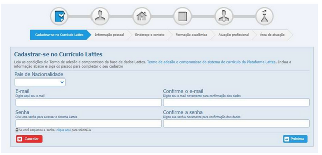

# Elaboração de Currículo

- O curriculum vitae (do latim "trajetória de vida"), também abreviado para CV ou apenas currículo (por vezes utiliza-se o termo curricula, como forma no plural do termo)
- 
  - Documento de tipo histórico, que relata a trajetória educacional e as experiências profissionais de uma pessoa, como forma de demonstrar suas habilidades e competências
  - É uma síntese de aptidões e qualificações, na qual o candidato a alguma vaga de emprego descreve, dados pessoais para contato, formação acadêmica e experiência profissional
  - Tem como objetivo fornecer o perfil da pessoa para um empregador, podendo também ser usado como instrumento de apoio em situações acadêmicas.

## Principais Campos:
  - Dados Pessoais e de Contato / Foto
  - Objetivo Profissional
  - Resumo
  - Experiência profissional
  - Formação acadêmica
  - Cursos complementares
  - Competências e habilidades
  - Informações complementares
 
### Dados Pessoais e de Contato/Foto
  - Nome completo;
  - Nacionalidade, estado civil e idade
  - Endereço, Cidade(Estado) e CEP
  - Telefones (DDD+número), se possível colocar em ordem de "facilidade em te encontrar"
  - E-mail pessoal
  - Link para site pessoal, "portfócio e redes sociais

### Objetivo Profissional 
  - Cargo que deseja
  - Área que deseja
  - Alguns exemplos são “coordenador administrativo”, “jovem aprendiz”, “estagiário de marketing”.

### Resumo
  - Aqui é importante destacar, em um ou dois parágrafos, suas experiências, empresas ou setores em que trabalhou, formação acadêmica e habilidades extras.

### Experiência profissional
  - Nome da empresa + breve descrição (segmento, porte, nacionalidade);
  - Cargo + data de início/fim + principais atividades e, se possível, alguns destaques/resultados.

### Formação acadêmica
  - Aqui, a ideia é listar a sua formação, especialmente graduação e pós, se você tiver, e cursos técnicos ligados à sua área de interesse.
    - Nível (Técnico, Tecnólogo, Bacharelado etc) + nome do curso e da instituição de ensino + data de início/fim.
   
### Cursos complementares
  - Destacar os cursos que estejam ligados à sua área de interesse.
  - Nome do curso e da instituição + carga horária total + data de início/fim (lembre-se: foque em seu objetivo profissional).
  - Se, por exemplo, você quer ser Analista Comercial, deixe de lado aquela palestra sobre seu horóscopo ou o curso de culinária.

### Competências e habilidades

- Algumas informações complementares que não estão diretamente relacionadas aos campos anteriores podem
chamar a atenção do recrutador.
  - Se tem disponibilidade para viagens, por exemplo, pode usar este espaço para dizer isso.
  - Se é fluente em inglês e tem conhecimento básico de espanhol, também.
  - Se conhece softwares específicos da sua área ou sabe tudo de Excel, pronto: este é o lugar para tratar desses assuntos.
  - Se participa de algum grupo como conselho, instituição ou ONG, destaque sua contribuição para a sociedade.
 
### Informações complementares

- Você tem mais informações para contar mas elas não se encaixam em nenhum tópico acima?
- Se já fez intercâmbio, se participou de alguma palestra importante
- Se já ganhou prêmios
- É importante tomar o cuidado de incluir apenas o que for relevante para o cargo que você quer ocupar ou a empresa em que você quer trabalhar.

## Plataforma Lattes

- Vamos criar o seu lattes?
  - https://lattes.cnpq.br/
  - Cadastrar novo currículo
 

