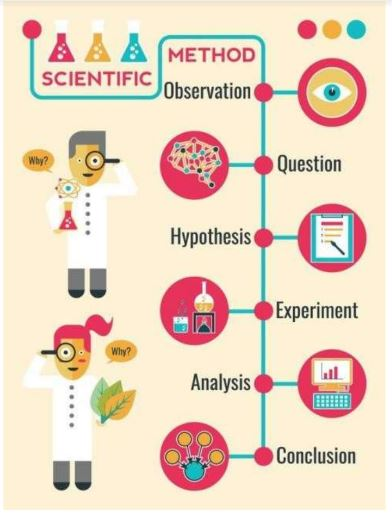

# O Método Científico e Objetivo de Pesquisa

## A disciplina de metodologia apresentada como se fosse um trabalho de pesquisa

- Tema
  - Problema de Pesquisa
- Objetivos
- Bibliografia
- Justificativa
- Método
  - Hipóteses
- Limitações da Pesquisa
- Resultados Esperados

## Etapas do Trabalho de Pesquisa

- Primeiro de tudo: ter um tema e um problema, em seguida:
- Revisão bibliográfica: conceitos necessários para a compreensão do objetivo
- Objetivo: definir um objetivo claro a ser perseguido
  - idealmente enunciado como uma hipótese
- Método: informa como alcançar o objetivo
- Justificativa: evidenciar porque o método é promissor ao objetivo proposto
- Resultados esperados: o que muda com o objetivo alcançado

## Tema

- O tema da pesquisa frequentemente depende do interesse do aluno e do orientador
- Não se recomenda em hipótese alguma uma pesquisa cujo tema não seja compatível com os conhecimentos do orientador

## Especialização do tema (exemplo)

- Ciência da Computação
  - Inteligência Artificial
    - Métodos de busca
      - Busca heurística
        - AlgoritmoA*
       
## Escolhendo um tema

•Exemplo: “este trabalho propõe usar a metáfora de formigueiro para modelar pacotes em rede”
- O que há de errado com outros modelos?
- Qual o problema que será resolvido?
- Apesar de interessante, qual é o propósito?
- Porque a metáfora de formigueiro possivelmente levará a melhores resultados (justificativa)?

- O tema principal deve ser **computação**
- O aluno deve evitar a tentação de contribuir para uma área (de aplicação) que ele não conhece ou que conhece muito pouco
- Dificilmente o aluno de Computação irá propor e defender
uma nova técnica cirúrgica

## Problema de Pesquisa

- O problema tem três partes:
  - Um enunciado preciso da questão ou problema que o trabalho trata
  - Uma explicação por referência direta à bibliografia de
que esta questão de pesquisa ainda não foi tratada
  - Uma discussão sobre porque é importante tratar essa
questão de pesquisa

- Questões que devem ser respondidas:
1. Sobre o que é a pesquisa?
2. O que ainda não se sabe a respeito do tópico de pesquisa?
3. Por que é importante esclarecer essa(s) questão(ões) em aberto?

##  A questão ainda não foi tratada?

- Uma boa revisão bibliográfica é necessária para apresentar tal justificativa com suficiente autoridade
- Afirmações do tipo “não encontrei nada parecido” devem ser evitadas
  - Sempre existe um problema que pode ser considerado o mais próximo possível

## Escolhendo o Objetivo de Pesquisa

- Tarefa difícil
- Não confundir com o TEMA
  - Ex: “Tema: Influência da batata inglesa na língua portuguesa” -> o que se quer provar?
  - Ex: Tema: “algoritmos evolutivos” e o objetivo é desenvolver uma nova técnica de mutação que supera a técnica de mutação mais aceita na literatura
- Comporta uma hipótese de trabalho
  - Demonstrar que a hipótese x é verdadeira
 
## Objetivos inadequado

- "O objetivo deste trabalho é aumentar os meus conhecimento na área de estudo"
- "Fazer um estudo sobre..."
- "Produzir uma dissertação sobre..."
- Etc

- "PROPOR"
- Todo trabalho propõe algo. A questão é O QUE?
  - Se o autor fizer a proposta, então o objetivo estará atingido?

## Objetivos

- O objetivo deve ser verificável ao final do trabalho -> hipótese válida ou inválida
- Verbos adequados: demonstrar, provar, melhorar
- Verbos inadequados: propor, estudar, apresentar, desenvolver -> usados apenas em contextos necessariamente originais
- Orientação: ao final, mostrar uma contribuição original ao conhecimento

## O Caminho para a Escolha de um Objetivo de Pesquisa

1 - Escolher um tema de pesquisa
2 - Realizar a revisão bibliográfica
3 - Definir o objetivo de pesquisa

## Hipótese de Pesquisa

- Afirmação da qual não se sabe a princípio se é verdadeira ou falsa
- É uma suposição que se faz a respeito do problema; uma explicação provisória
- Função do trabalho de pesquisa provar sua veracidade ou falsidade
- Se hipótese comprovada, ótimo
- Se não comprovada, pode-se derrubar algum mito

- Exemplo
- Lacuna (problema): não se tem informações sobre qual a melhor forma de se economizar gás durante o cozimento de arroz
- Objetivo: determinar a melhor forma de se economizar
gás durante o cozimento de arroz
- Hipóteses:
  - O gasto de gás de uma boca grande de fogão é o mesmo de uma boca pequena na preparação de uma panela de arroz
- É possível economizar gás
- Justificativa do trabalho/pesquisa: podem haver impactos relevantes na economia dos brasileiros

## Revisão Bibliográfica

- Deve acontecer durante todo o trabalho
- Para começar, livros introdutórios e surveys
- Buscas frequentes em repositórios de artigos relevantes
- Leitura crítica
- Anotações e estruturação do conhecimento
- Deve-se ser capaz de construir um mapa da área

## Justificativa

- Justificativa da Hipótese de pesquisa
  - Uma boa hipótese deve possuir uma justificativa, isto é, algum indicativo encontrado na revisão bibliográfica que leve à sua formulação -> maiores chances da hipótese ser válida
 
## Método de Pesquisa

- Delimitado apóx objetivo estar definido e alguma revisão literária já ter sido feita
- Passo a passo para executar o trabalho
    - Paradigmas de se resolver problemas (dependentes de cada área),
    - Indicação se haverá protótipos ou não,
    - Tipo de avaliação
    - Baselines com que se compara um método proposto.
 
## Limitações da Pesquisa

- É possível que um trabalho de pesquisa se inicie com um objetivo demasiadamente amplo, possivelmente
inalcançável no tempo disponível
- Situações assim, requerem cortes no objetivo ao longo do projeto
- Exemplo
  - Ao invés de se demonstrar que uma hipótese é sempre verdadeira, pode-se optar por demonstrar que ela é verdadeira apenas em determinadas condições -> muito comum

## Resultados Esperados

Resultados esperados da pesquisa
- Os resultados esperados são diferentes do objetivo
- O objetivo é o que é perseguido pelo pesquisador -> ao final, pode ter sido alcançado ou não
- Os resultados esperados possivelmente ocorrerão após a conclusão do trabalho -> expectativas -> “o que possivelmente mudaria no mundo se eu atingisse os objetivos da minha tese?”

Exemplo
- Objetivo: definir um método de cálculo de esforço em desenvolvimento de software mais preciso
- Resultados esperados: adoção do novo método pela indústria, e melhor desempenho das empresas produtoras de software

## A disciplina de metodologia apresentada como se fosse um trabalho de pesquisa

- Tema
- Objetivos
- Bibliografia
- Justificativa
- Método
  - Hipóteses
- Limitações da Pesquisa
- Resultados Esperados

## O Método Científico

- Não há **ciência** sem o emprego do método científico

- Método científico é "um conjunto de procedimentos por intermédio dos quais a) se propõe os problemas científicos e b) colocam-se à prova as hipóteses científicas" (Bunge, 1974a:55).

- “O método científico é um conjunto de regras básicas para desenvolver uma experiência a fim de produzir novo conhecimento, bem como corrigir e integrar conhecimentos pré-existentes. Na maioria das disciplinas científicas consiste em juntar evidências observáveis, empíricas (ou seja, baseadas apenas na experiência) e mensuráveis e as analisar com o uso da lógica.” (Wikipédia - Método)

## O Método Científico

Deve ser estabelecido depois que o objetivo tiver sido definido

O método deve então indicar, dependendo do tipo de trabalho:

- se protótipos serão desenvolvidos
- se modelos teóricos serão construídos
- quais experimentos eventualmente serão realizados
- como os dados serão organizados e comparados

## Pesquisa Experimental e Não-Experimental

- A pesquisa experimental implica em que o pesquisador sistematicamente provocará alterações no ambiente a ser pesquisado de forma a observar se cada intervenção produz os resultados esperados
- A pesquisa não experimental consiste no estudo de fenômenos sem a intervenção sistemática do pesquisador

## Empirismo

- Segundo Kerlinger (1980), “empírico significa guiado pela evidência obtida em pesquisa científica sistemática e controlada”
- O empirismo é importante para a ciência porque é uma maneira sensata de olhar o mundo.

## Qual o seu caso?

- Tema
- Lacuna/problema
- Hipóteses
- Objetivo
- Justificativa/motivação

### Atividade #4

Qual o seu caso?
  - Forme um grupo de 4 pessoas
  - Defina um tema

### Referências Bibliográficas

- MARCONI, Marina de Andrade; LAKATOS, Eva Maria. Fundamentos de metodologia científica. 5. ed.- São Paulo: Atlas, 2003.
- Slides da Profa. Elaine Faria - UFU - http://www.facom.ufu.br/~elaine/disc
