# 01 - Questão de Pesquisa e String de Busca
Caio Souza

## Revisão sistemática de literatura

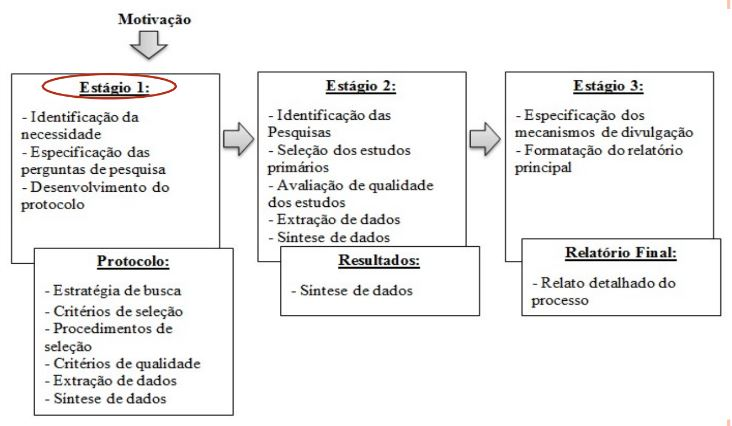

### Questões de pesquisa

- Parte mais importante de qualquer revisão sistemática
- Orientam toda a metodologia de revisão sitemática:
  - O processo de busca deve identificar os estudos primários que abordam as questões da pesquisa.
  - O processo de extração de dados deve extrair os itens de dados necessários para responder às perguntas.

### O que é PICO?

- **Population P = População, Problema, Processo**
  - A população não precisa ser humana. Na engenharia, na maioria das vezes é um problema ou processo.
- **Intervention I = Intervenção, Inquérito, Investigação, Melhoria**
  - Solução possível
- **Comparision C = Comparação**
  - Prática atual ou pontos de vista opostos
- **Outcomes O = Resultados, Desfecho**
  - Medindo o que funcionou melhor
 
### Fazendo a Pergunta

- Formular a questão de pesquisa usando o PICO
  para:
- Identificar elementos de pesquisa relacionados ao tema
- Selecione palavras-chaves que representem esses elementos
- Recuperar artigos de pesquisa relevantes quando as palavras-chave PICO são usadas

### Questões de Pesquisa - Estrutura PICO

- **População (Population):** um papel de engenharia de software específico (testador), categoria (novatos, experientes), área de aplicação (sistemas de controle), grupo (pequenas empresas)
- **Intervenção (Intervention):** metodologia / ferramenta / tecnologia / procedimento de engenharia de software (ferramenta para testa de software)
- **Comparação (Comparison):** é a metodologia / ferramenta / tecnologia / procedimento de engenharia de software com a qual a intervenção está sendo comparada
- **Desfecho (Outcomes):** Os resultados de importância para os profissionais, tais como maior confiabilidade, redução dos custos de produção e redução do tempo de colocação no mercado.
 
### Questão de Pesquisa - PICO

- QPP: Sob que condições a utilização de **metodologias ágeis** influencia no processo de **engenharia de requisitos** em **projetos de pequeno e médio** porte?
- População: projetos de pequeno e médio porte;
- Intervenção: metodologias ágeis;
- Comparação: outras metodologias de desenvolvimento de software;
- Desfecho: influencia no processo de engenharia de requisitos.

- QP1 - Quais os impactos positivos e negativos da adoção de métodos ágeis na engenharia de requisitos?
- QP2 - Quais os métodos de pesquisa utilizados para avaliar o impacto de metodologias ágeis na engenharia de requisitos?
- QP3 - Que abordagens de engenharia de requisitos melhor se adequam à metodologia ágeis? Quais as não se adequam?
- QP4 - Que abordagens de desenvolvimento de software que são usadas na fase de engenharia de requisitos?

### String de Busca

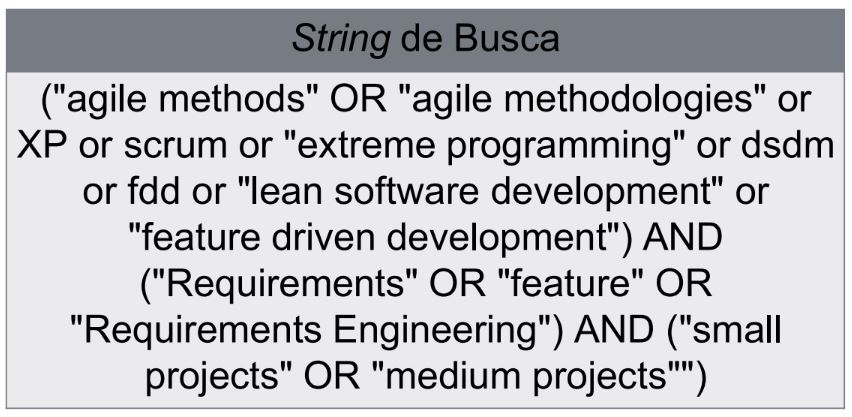

Questão de Pesquisa

- QPP: Qual é **o estado atual** da investigação sebre **técnicas de privacidade e segurança** na **Engenharia de Requisitos**?
- População: Engenharia de Requisitos;
- Intervenção: técnicas de privacidade e segurança;
- Comparação: outras técnicas
- Desfecho: estado atual da investigação

Questão de Pesquisa

- QPP: Qual é o estado atual da investigação sobre técnicas de privacidade e segurança na Engenharia de Requisitos?
  - QP1: Quais tópicos de pesquisa são investigados sobre técnicas de privacidade e segurança na engenharia de requisitos?
  - QP2: Quais métodos de pesquisa são utilizados sobre técnicas de privacidade e segurança na engenharia de requisitos?
  - QP3: Quais os tipos de trabalho?
  - QP4: Qual o problema de pesquisa que está sendo resolvido?
  - QP5: Quais as tendências, em se tratando de trabalhos futuros?
 
String de Busca

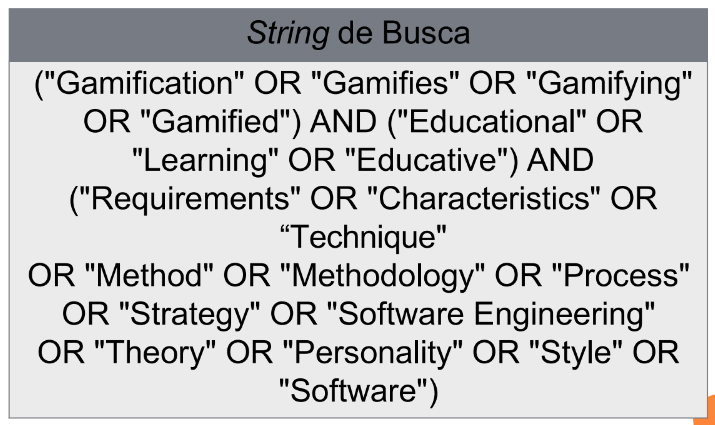

Questão de Pesquisa

- QPP: Qual o conjunto de requisitos da gamificação para softwares educacionais que contemplem tipos de personalidade?
- População: softwares educacionais;
- Intervenção: conjunto de requisitos da gamificação;
- Comparação: outros requisitos que não são gamificados;
- Desfecho: contemplem os tipos de personalidade dos alunos.

Questão de Pesquisa

- QPP: Qual o conjunto de requisitos da gamificação para softwares educacionais que contemplem os tipos de personalidade?
  - QP1: Quais são os tipos de softwares, as modalidades de ensino e os objetivos educacionais propostos com a gamificação?
  - QP2: Quais são as principais características, em termos de requisitos, necessárias à criação de softwares gamificados voltados à educação?
  - QP3: Existe alguma abordagem que considere os tipos de personalidade dos alunos em softwares gamificados voltados à educação?
 
 
String de Busca

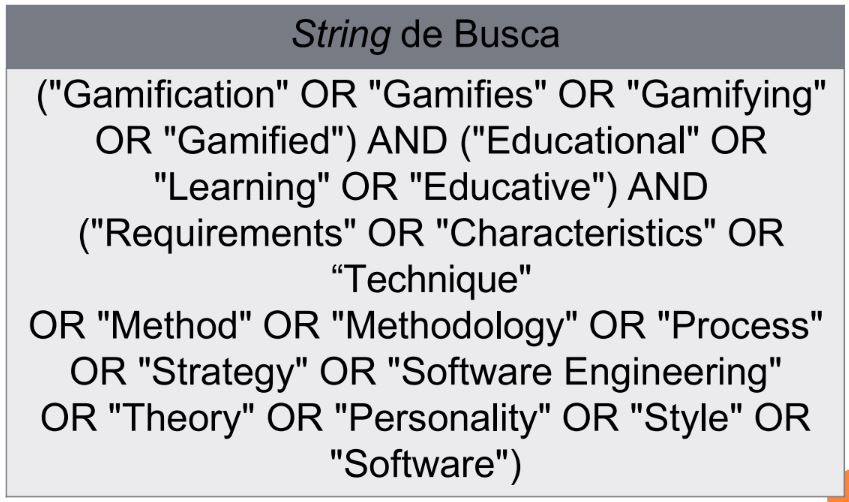

# 02 - String e Engenhos de Busca

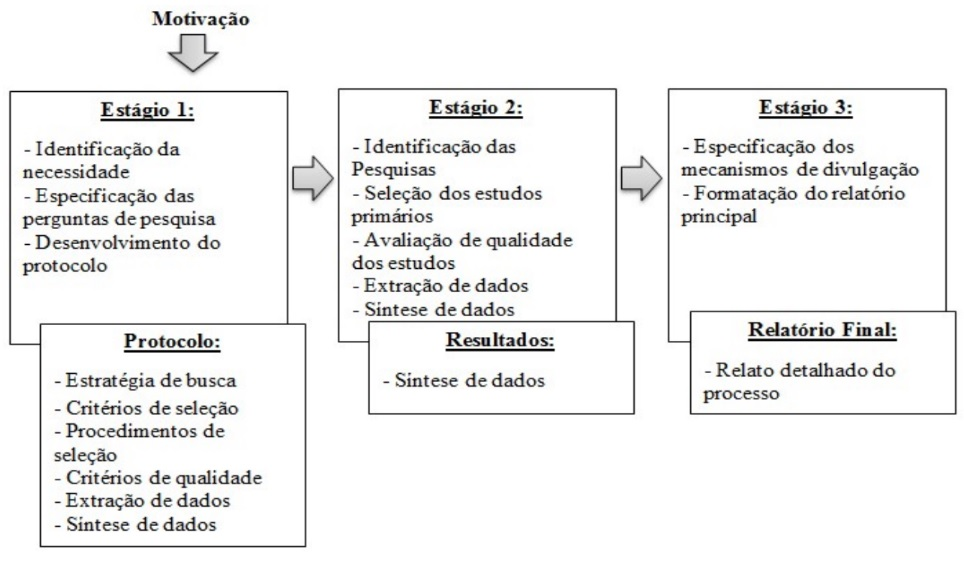

## Busca Manual

- Quais são as principais características, em termos de requisitos, necessárias à criação de softwares gamificados voltados à educação?
- Simpósio Brasileiro de Informática na Educação (SBIE)
  - http://www.br-ie.org/pub/index.php/sbie/issue/archive
- Revista Novas Tecnologias na Educação (RENOTE)
  - http://seer.ufrgs.br/renote
 
## Pergunta de pesquisa - Busca Automática

- Sob que codição a utilização de **metodologias ágeis** influencia no processo de **engenharia de requisitos** em **projetos de pequeno e médio** porte?

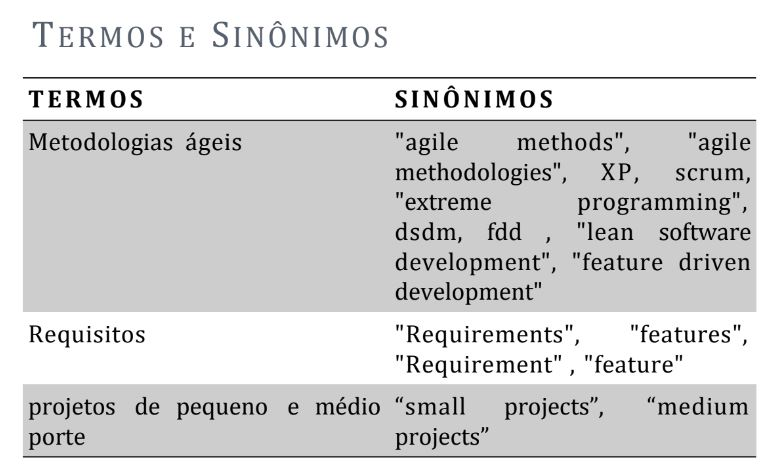

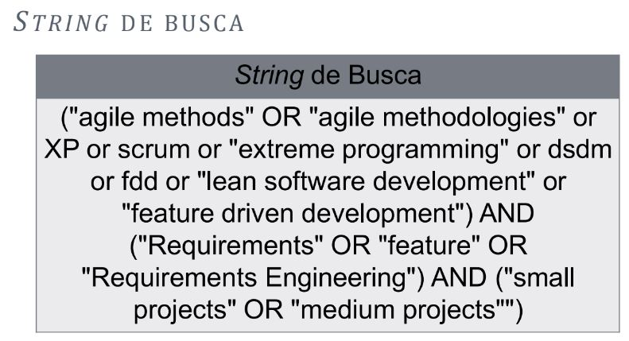

## Pergunta de Pesquisa

- Quais **critérios** de **priorização** são discutidos na literatura de priorização de **requisitos**?

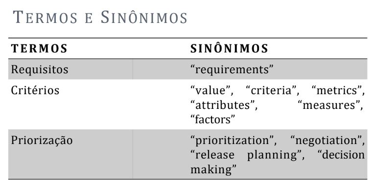

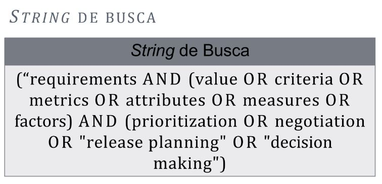

## Pergunta de Pesquisa 

- Qual é o estado atual da investigação sobre **privacidade** e **segurança** na **Engenharia de Requisitos**?

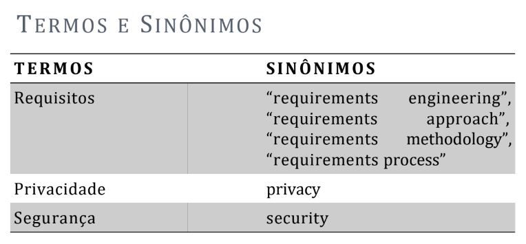

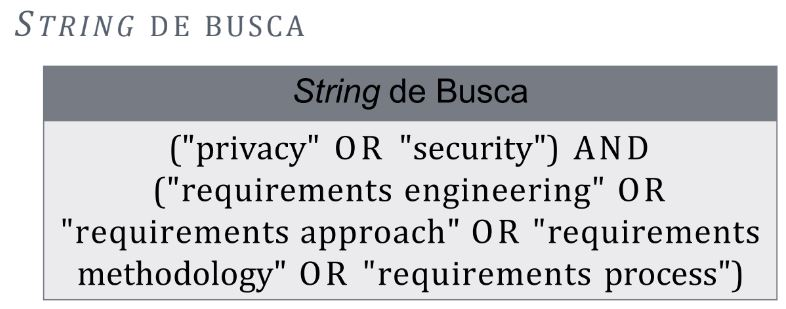

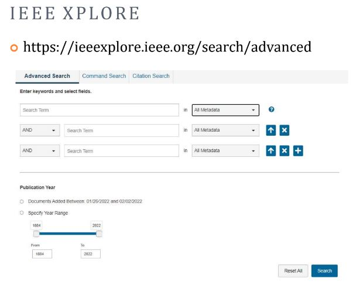

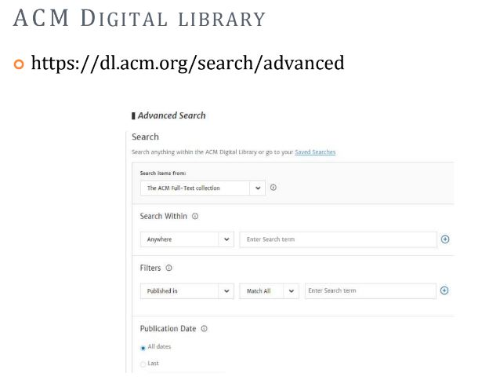

# 03 - Definindo os critérios de inclusão e exclusão e o período da busca

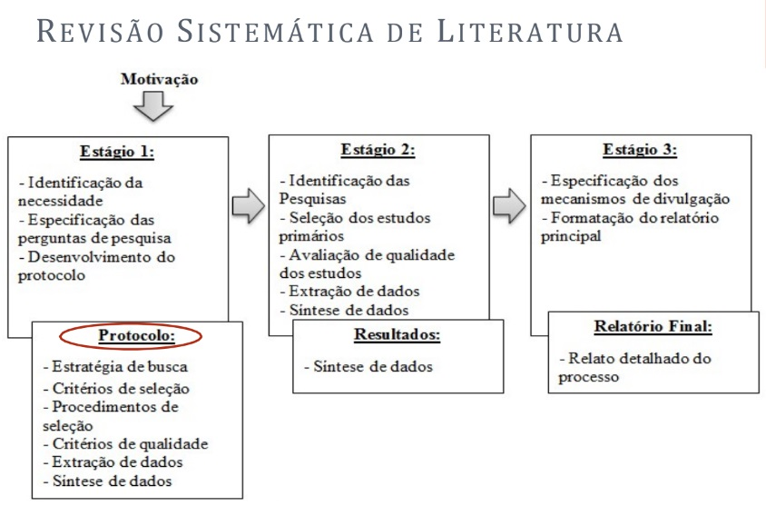

## Critérios de inclusão e exclusão

- Faz parte do processo de seleção
- Utilizado para definir mais precisamente os trabalhos selecionados, deve-se estabelcer os limites de sua extensão
- Pode tomar como base:
  - Língua
  - Revistas
  - Autores
  - Configurações
  - Participantes ou sujeitos
  - Projeto de pesquisa
  - Método de amostragem
  - Data da publicação
 
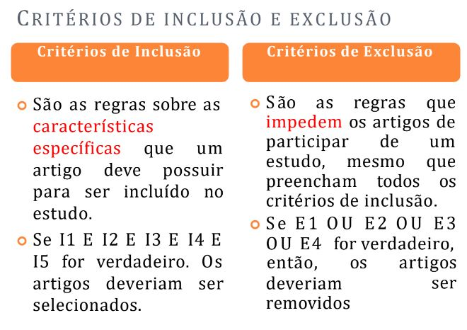

## Questão de Pesquisa

- **QPP: Sob que condições a utilização de metodologias ágeis influencia no processo de engenharia de requisitos em projetos de pequeno e médio porte?
  - **QP1** - Quais os impactos positivos e negativos da adoção de métodos ágeis na engenharia de requisitos?
  - **QP2** - Quais os métodos de pesquisa utilizados para avaliar o impacto de metodologias ágeis na engenharia de requisitos?
  -  **QP3** - Que abordagens de engenharia de requisitos melhor se adequam à metodologias ágeis? Quais as que não se adequam?
  -  **QP4** - Que abordagens de desenvolvimento de software que são usadas na fase de engenharia de requisitos?
 
## Critérios de inclusão e exclusão
- Critérios de Inclusão:
  - Estudos revisados por pares;
  - Estudos Acessíveis
  - Estudos Empíricos
- Critérios de Exclusão:
  - Estudos duplicados (apenas uma cópia de cada estudo deve ser incluída)
  - Estudos incompletos (shirt papers, apresentações, dissertações, teses, estudos, secundários, terciários e meta-análise)
  - Estudos que não apresentam como foco, desenvolvimento ágil de software
  - Estudos não focados em projetos de médio e pequeno porte
  - Estudos que não sejam escritos em inglês espanhol ou português
 
## Questão de Pesquisa

- **QPP: Qual o conjunto de requisitos da gamificação para softwares educacionais que contemplem os tipos de personalidade?**
  - QP1: Quais são os tipos de softwares, as modalidades de ensino e os objetivos educacionais propostos com a gamificação?
  - QP2: Quais são as principais características, em termos de requisitos, necessárias à criação de softwares gamificados voltados à educação?
  - QP3: Existe alguma abordagem que considere os tipos de personalidade dos alunos em softwares gamificados voltados à educação?

## Critéiros de inclusão e exclusão

- Critérios de Inclusão:
  - Estudos Primários
  - Estudos revisados por pares
  - Estudos que analisam características de softwares educacionais gamificados
  - Estudos acessíveis
- Critérios de Exclusão:
  - Estudos que não abordam a educação como foco do software gamificado
  - Estudos duplicados (apenas uma cópia de cada estudo foi incluída)
  - Estudos incompletos, secundários e terciários
  - Estudos que tratam a gamificação na educação como trabalhos futuros
 
## Questão de Pesquisa

- Q P P. O que é atualmente conhecido sobre os benefícios e limitações do uso de job rotation em organizações de software?
  - QP1.1. Qual é a evolução do número de estudos ao longo dos anos?
  - QP1.2. Que métodos de pesquisa têm sido utilizados para investigar de job rotation na engenharia de software?
  - QP1.3. Quais são os tipos de de job rotation aplicados em um contexto de engenharia de software?
  - QP1.4. Quais foram os objetivos para fazer uso de job rotation o nas organizações investigadas?
  - QP1.5. Quais foram os benefícios e limitações da aplicação de de job rotation nos estudos selecionados?
 
## Critérios de inclusão e exclusão

- Estudos selecionados apresentando conceitos, teorias, diretrizes, discussões, lições aprendidas e relatos de experiência sobre a prática de job rotation no campo da engenharia de software (critérios de inclusão)
- Documentos excluídos que caíram em qualquer dos oito critérios de exclusão:
  - (1) Escrito em outras línguas que não o inglês;
  - (2) Não acessível na Web;
  - (3) Documentos enviados para avaliação, palestras, relatórios de seminários, livros, teses e dissertações;
  - (4) Documentos incompletos, rascunhos, slides de apresentações e resumos;
  - (5) Abordar outras áreas além da informática (por exemplo, negócios e gestão, ciências sociais, saúde e outros);
  - (6) Estudos que citam ou referenciam apenas artigos sobre job rotation, mas não abordam job rotation em seus achados;
  - (7) Abordar tópicos de ciência da computação claramente não relacionados à engenharia de software (por exemplo, sistemas de banco de dados, interação homem-computador, redes de computadores, inteligência artificial, etc.);
  - (8) Trabalhos que não apresentem qualquer tipo de achados ou discussões sobre a prática de job rotation no contexto da engenharia de software.
 
  Referências

- Santos, Ronnie E S , Fabio Q B da S ilva, and Cleyton VC de Magalhães. "Benefits and limitations of organizations: job rotation in software a systematic literature review." Proceedings of the 20th International Conference on Evaluation and Assessment in Software Engineering. AC M , 2016.

# 04 - Lendo o trabalho completo

## Processo de Seleção

## Planilha de seleção extração de dados

- A seleção e extração de dados deve ser projetada para coletar todas as informações necessárias para abordar as questões da revisão (KITCHENHAM; CHARTERS, 2007).

## Planilha de seleção extração de dados

- A seleção e extração dos dados é realizada por meio de uma planilha e contém os seguintes campos:
  - **Etapa 1, 2, e 3 (Seleção): [] Identificador, [] Data da Leitura, [] Fonte, [] Ano, [] Afiliações, [] Lista de Autores, [] Título, [] Palavras Chaves, [] Resposta dos critérios de inclusão e exclusão, [] Campo para aceitar ou rejeitar o artigo...
  - Etapa 3 (Extração): **Respostas das questões de pesquisa.**
