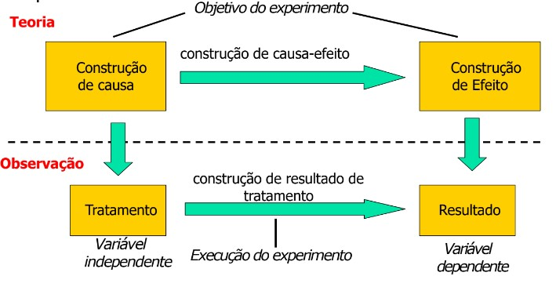
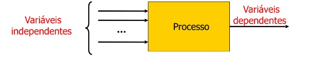
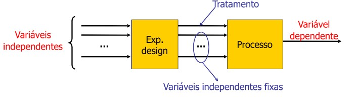

# Experimentação
## Planejando e projetando seu experimento

# Experimentos são úteis para:

- Confirmar as teorias conhecidas
- Confirmar (ou às vezes refutar) um conhecimento comum
- Explore as relações existentes entre as variáveis
- Muitas vezes você acredita que algo é verdade
  - ... mas então você poderá descobrir muitas surpresas

# In vitro ou in vivo

- In vitro:
  - Realizado em laboratório
  - Condições controladas
  - Custos razoáveis, baixo risco
    - Experimentos realizados com alunos para avaliar a eficácia de uma técnica de teste
  - A realidade poderia ser diferente
- Usar o experimento para preparar estudos adicionais num contexto mais realista

- In vivo:
  - Projetos reais
  - Não é possível controlar as condições experimentais
  - Configurações e tópicos mais realistas
  - Os resultados podem ser diferentes
  - Custos mais elevados
  - Riscos possivelmente inaceitáveis
- Podemos fazer isso quando tivermos certeza de que o estudo está maduro
  - Experimentos in vitro fornecem resultados encorajadores

# O processo experimental

## Por onde começamos?

  - Temos uma ideia/conjectura sobre uma relação de causa e efeito
  - Temos uma teoria
  - Assim podemos formular uma hipótese
  - E para testar... fazemos um experimento!

## Princípios experimentais

# Terminologia - I

- **Variáveis depéndentes:** variáveis que estamos interessados em estudar
- **Variáveis independentes:** variáveis que controlamos
Exemplo: avaliar a produtividade (**variável dependente**) com base no método de desenvolvimento, habilidades, ferramentas (**variáveis independentes**)

# Terminology - II

- O experimento estuda como as mudanças que ocorrem na **variáveis independentes** (**fatores**) influenciam uma **variável dependente**

# Terminology - III

- Um tratamento é aplicado a uma combinação de **sujeitos** e **objetos**
- Um experimento é um conjunto de **teste** (ou **ensaios**) definidos como combinação de tratamentos, sujeitos e objetos.
  - Joe (**sujeito**) usa o novo método de desenvolvimento (**tratamento**) para desenvolver o programa A (**objeto**)
  - O número de teste influencia a capacidade de tirar conclusões estatisticamente significativas

# Controlando as variáveis

# Etapas de um processo experimental

# Definições do experimento

# Fase de Definição

- Baseado em Métricas de Metal e Questões

- Apresenta a base para a experimentação

- Definição errada -> resultados inúteis

# Modelo de definição de meta

Analisar <Objeto(s) de estudo>

para o propósito de <Propósito>

com relação ao seu <Foco na qualidade>

do ponto de vista da <Perspectiva>

no contexto de <Contexto>

# Modelo de definição de meta - II

(16)

