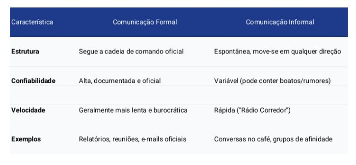

## Comunicação Técnica

### Fundamentos da Comunicação

#### O que é Comunicação?

A comunicação é o processo de transmissão e recepção de mensagens

Não basta apenas transmitir a informação; ela deve ser compreendida pelo receptor

Se não houver compartilhamento de sentido, não houve comunicação efetiva

#### O Processo de Comunicação

- Objetivo: gerar compreensão, influenciar comportamentos ou compartilhar informações

- A comunicação ocorre por meio da interação entre emissor, receptor, contexto, mensagem, código, canal e feedback
  - O emissor estrutura a mensagem utilizando um código (língua, símbolos, gráficos) e a envia por um canal
  - O contexto é a situação social, cultural e/ou organizacional que envolve a comunicação
  - O receptor interpreta a mensagem e fornece feedback, permitindo confirmar a compreensão

#### Funções da Comunicação
- Informar: transmitir dados e fatos
- Orientar/Persuadir/Motivar: influenciar comportamentos e atitudes
- Entreter: gerar diversão e engajamento
- Educar: promover aprendizagem
- Expressar emoções: transmitir sentimentos e sensações
- Integrar: fortalecer vínculos organizacionais entre pessoas e equipes

#### Tipos de Comunicação

- Verbal: pode ser oral ou escrita e é amplamente utilizada em ambientes corporativos
- Não verbal: envolve postura, expressões e gestos, complementando ou contradizendo a mensagem verbal
- Visual: utiliza gráficos, diagramas e imagens para reforçar ou sintetizar informações
- Formal: estruturada e oficial
- Informal: espontânea e casual
- Síncrona: ocorre em tempo real
- Assíncrona: ocorre em tempos diferentes

#### Comunicação Formal vs Informal

#### Barreiras à Comunicação Eficaz

- Filtragem: Manipulação da informação pelo emissor para que seja vista mais favoravelmente pelo receptor

- Percepção Seletiva: O receptor vê e escuta seletivamente com base em suas necessidades e experiências

- Emoções: O estado emocional do receptor no momento da comunicação influencia a interpretação

- Linguagem e Jargão: Palavras têm significados diferentes para pessoas diferentes (ex. técnicos vs. leigos)

### Comunicação Organizacional e Técnica

### Apresentações Orais
